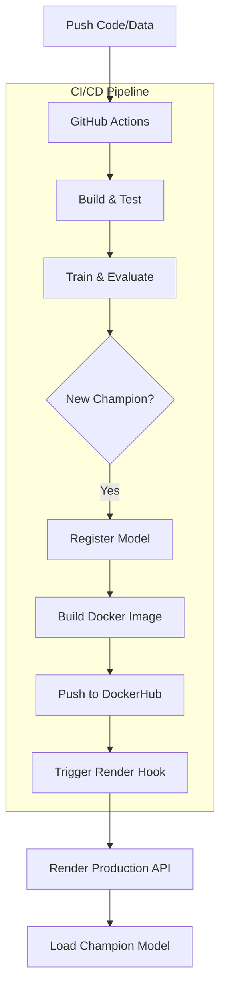

# 🧠 MLOps Demand Forecasting Pipeline

A professional, fully automated end-to-end MLOps system for demand forecasting. This project automates the entire lifecycle from model training and champion selection to containerized production deployment.

## 🚀 Key Features
- **Continuous Training (CT)**: Automated model training and evaluation using MLflow.
- **Champion-Challenger Logic**: Automatically registers the best-performing model (RMSE-based) for production.
- **Artifact Persistence**: Robust handling of MLflow model registries across CI/CD jobs.
- **Dockerized API**: FastAPI-based prediction service optimized for containerized environments.
- **Automated Deployment**: Seamless delivery to **Render** via Docker Registry and Deploy Hooks.

---

## 🏗️ Architecture Overview



---

## 📁 Project Structure

| Path | Description |
| :--- | :--- |
| `src/pipeline/` | Core training and champion-selection logic. |
| `src/api/` | FastAPI application for serving predictions. |
| `src/monitoring/` | Drift detection and model performance monitoring. |
| `configs/` | Model hyperparameters and pipeline configurations. |
| `data/` | Dataset and data-loading utilities. |
| `.github/workflows/` | CI/CD pipeline definitions (GitHub Actions). |
| `mlruns/` | (Generated) Local MLflow model registry. |

---

## 🛠️ Getting Started

### 1. Installation
```bash
pip install -r requirements.txt
```

### 2. Local Training
```bash
python -m src.pipeline.train_pipeline
```

### 3. Local API Execution (Docker)
```bash
docker build -t demand-mlops .
docker run -p 8000:8000 demand-mlops
```

---

## 🤖 CI/CD Automation (MLOps Loop)

### Triggering a Run
The pipeline triggers automatically on every push to `main` that affects the `src/`, `configs/`, or `data/` directories.

### REQUIRED GitHub Secrets
To fully enable the automation, ensure the following secrets are set in your repo:
- `DOCKER_USERNAME`: Your DockerHub username.
- `DOCKER_PASSWORD`: Your DockerHub PAT.
- `RENDER_DEPLOY_HOOK_URL`: The unique deploy URL from your Render Dashboard.

---

## 📬 API Usage

**Endpoint**: `GET /`
- **Description**: Health check and model status validation.
- **Response**: `{"message": "API up", "model_status": "Loaded"}`

---

## 🛠️ Maintainers
- **VedantJadhav701** (Lead Engineer)
